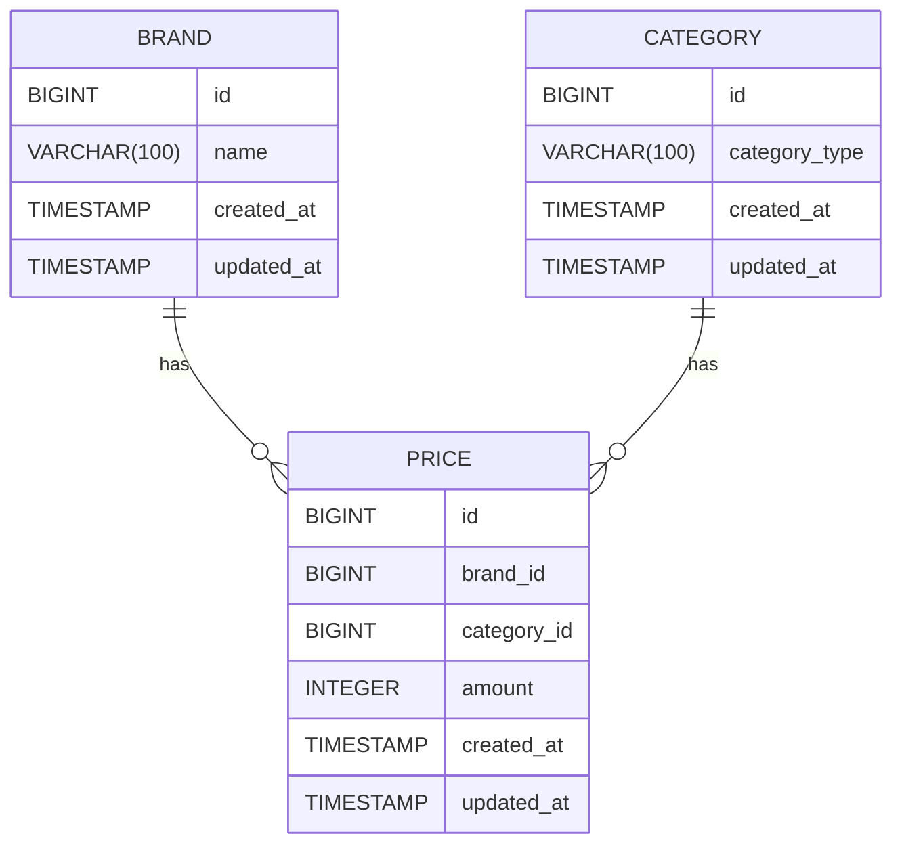

# 구현 범위

-   유저와 운영자 계정을 구분하기 위해서 미리 계정을 memory 에 저장했습니다
-   유저 정보는 아래와 같습니다.
-   user : 카테고리 별 최저가격 브랜드와 상품 가격, 총액 조회 API, 단일 브랜드로 모든 카테고리 상품을 구매할 때 최저가격에 판매하는 브랜드와 카티고리의 상품가격, 총액 조회 API, 카테고리 이름으로 최저,최고 가격 브랜드와 상품 가격 조회 API 에 접근 할 수 있습니다
-   admin : 상품 목록 조회 API, 브랜드 추가 API, 브랜드 삭제 API, 카테고리 가격 수정 API, 카테고리 가격 삭제 API, 카테고리 가격 추가 API 에 접근 할 수 있습니다

```
유저
ID : user
PW : 1234

운영자
ID : admin
PW : 1234
```

-   카테고리 별 최저가격 브랜드와 상품 가격, 총액 조회 API

```
GET http://localhost:8080/client/categories/min-price
```

-   단일 브랜드로 모든 카테고리 상품을 구매할 때 최저가격에 판매하는 브랜드와 카티고리의 상품가격, 총액 조회 API

```
GET http://localhost:8080/client/brand/min-price
```

-   카테고리 이름으로 최저,최고 가격 브랜드와 상품 가격 조회 API

```
GET http://localhost:8080/client/category/{category}/min-max-price
```

-   상품 목록 조회 API

```
GET http://localhost:8080/admin/goods
```

-   브랜드 추가 API

```
POST http://localhost:8080/admin/brand
```

-   브랜드 삭제 API

```
DELETE http://localhost:8080/admin/brand/{brandName}
```

-   카테고리 가격 수정 API

```
PUT http://localhost:8080/admin/category
```

-   카테고리 가격 삭제 API

```
DELETE http://localhost:8080/admin/categor
```

-   카테고리 가격 추가 API

```
POST http://localhost:8080/admin/category
```

# 코드 빌드 방법

1. java 21 버전을 설치합니다
2. 아래 명령어를 입력하여 빌드 합니다

```bash
cd coordination/
./gradlew clean build -x test
```

# 실행 방법

1. 아래 명렬어를 이요하여 빌드된 jar 파일을 실행합니다

```bash
cd coordination/build/libs
java -jar coordination-0.0.1-SNAPSHOT.jar
```

2. dockerfile를 이용하여 실행합니다

```bash
cd coordination/
docker-compose up
```

# 테스트 방법

1. 웹 페이지를 통한 테스트 방법

-   위의 방법대로 웹 서버를 실행합니다
-   웹 브라우저에서 http://localhost:8080/ 로 접속합니다
-   미리 저장된 아래 계정들을 통해서 로그인 후 화면에서 기능을 확인 할 수 있습니다

```
유저
ID : user
PW : 1234

운영자
ID : admin
PW : 1234
```

2. 테스트 코드를 통한 테스트 방법

-   AdminControllerTest.java, CoordinationControllerTest.java 에 있는 단위 테스트로 해당 기능들을 테스트 할 수 있습니다

# ERD


